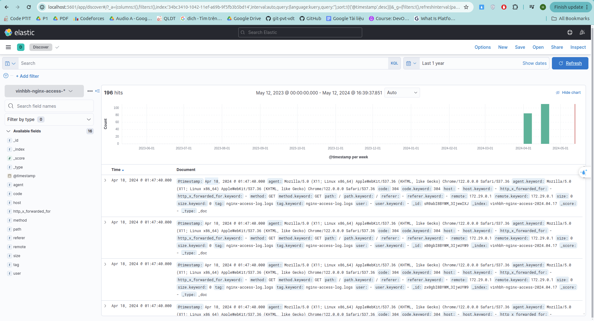

elasticsearch and fluent-plugin-elasticsearch inside fluentd need to be compatible with elasticsearch, kibana version
List version of fluent-plugin-elasticsearch
https://rubygems.org/gems/fluent-plugin-elasticsearch/versions
This project is using fluent-plugin-elasticsearch version 5.2.5 and elasticsearch version 7.14.0
